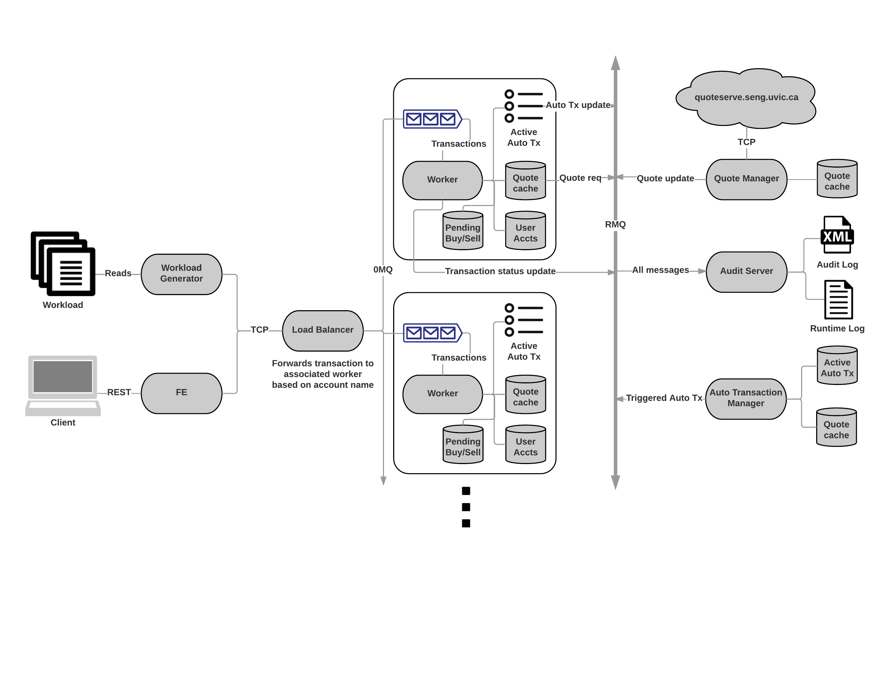

Reports and other dev notes
=====

### Contents
- [Lab config](./lab_config/lab_config.md)
  - [Go Setup](./lab_config/lab_config.md#go-setup)
    - [Installing Go Locally](./lab_config/lab_config.md#installing-go-locally)
  - [Resources](./lab_config/lab_config.md#resources)
    - [Port Assignments](./lab_config/lab_config.md#port-assignments)
    - [Network Storage](./lab_config/lab_config.md#network-storage)
- [Business Logic](./business_logic/business_logic.md)
  - [BUY](./business_logic/business_logic.md#buy)
  - [Triggers](./business_logic/business_logic.md#triggers)
- [Reports](./reports/reports.md)
  - [Architecture](./reports/architecture/readme.md)
