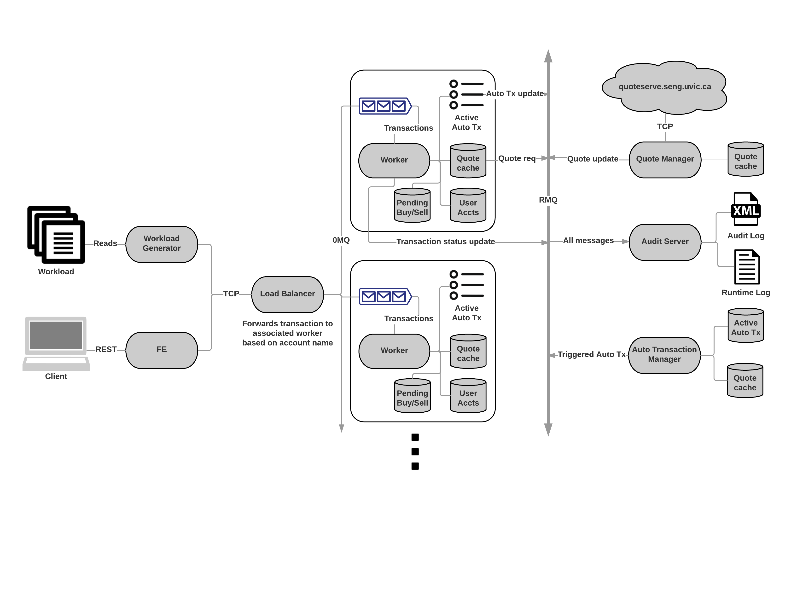

Project Plan
===

## Project Overview
The goal of the system is to emulate a stock market daytrading system. The actions it must accomplish are detailed under the initial requirements section. The project will be completed using golang, ZeroMQ, and most likely JavaScript for the frontend client. These architectural design decisions are detailed under the architecture section.

## Initial Requirements
The project must support at minimum the following commands:
- Add: Add the given amount of money to the user's account
- Quote: Get the current quote for the stock for the specified user
- Buy: Buy the dollar amount of the stock for the specified user at the current price.
- Commit Buy: Commit the most recently executed BUY command.
- Cancel Buy: Cancels the most recently executed BUY command.
- Sell: Sell the specified dollar amount of the stock currently held by the specified user at the current price.
- Commit Sell: Commit the most recently executed SELL command.
- Cancel Sell: The user must have executed a SELL command within the previous 60 seconds.
- Set Buy Amount: Set a defined amount of the given stock to buy when the current stock price is less than or equal to the Buy Trigger.
- Cancel Set Buy: Cancels a Set Buy command issued for the given stock.
- Set Buy Trigger: Sets the trigger point base on the current stock price when any set buy will execute.
- Set sell amount: Set the defined amount of the specified stock to sell when the current stock price is equal or greater than the sell trigger point.
- Set Sell Trigger: Sets the stock price trigger point for executing any set sell triggers associated with the given stock and user.
- Cancel Set Sell: Cancels the set sell associated with the given stock and user.
- Dumplog: Print out the history of the users transaction to the user specified file.
- Display Summary: Provide a summary to the client of the given user's transaction history and the current status of their accounts as well as any set buy or sell triggers and their parameters.

Additionally, the system must support a minimum of 1000 users.

Finally, the system must have a frontend client which allows the user to navigate the system.

Architecture
===

## Overview
We'll be using a sharded architecture to exploit parallelism in the transaction set. No transactions allow users to interact with each other so user data doesn't need to be consolidated. All transactions for a user will be sent to a single worker. The user base will be evenly split between workers. Full worker responsibilities are detailed later.

Unless otherwise stated, all modules will be written in Go 1.7.4. Go has exceptional support for concurrent code execution and offers a fast runtime environment. Unit testing, benchmarking and profiling functionality is included in the standard library. Installation on lab machines will be simple because Go binaries are dependency free and can be cross-compiled.

## Incoming traffic
Transactions will be sent to the load balancer at the TCP socket level, using a pre-defined serialization format very similar to what is provided in the workload files.

### Client front end
A frontend server will host static-ish pages that allows clients to log in, view their accounts and execute trades. Interaction should use REST but we'll probably end up sending data back and forth through web forms because it's faster to develop. Amount of polish and technology choice will heavily depend on how quickly we can scale to a full workload. Ideally, this should use a modern web development package like React or Vue.

Web page will do cursory input sanitization and validation (e.g. reject a purchase for negative dollars but checks against user account quantities such as stock holdings will occur later.)

### Workload generator
Reads a provided workload file and generates requests identical to those coming from the FE. Requests will have a flag that indicates the transaction should run to completion but return no data.

## Load balancing
Forwards the transaction to its worker based on the user ID. When the transaction is finished it returns the contents (which may only be an ACK) to the client.

The design goal for the load balancer is maximum throughput. It should be a stateless router. Zero Message Queue (0MQ) offers high throughput and a configurable broker that can scale horizontally.

## Worker
Transactions arrive from the load balancer and are place in a queue. The worker parses the transaction and executes it. It maintains user accounts (balance and stock holdings), a local quote cache and a list of active automatic transactions (ATXs). All of the components of a worker live on the same machine.

Performance can be scaled horizontally by adding more workers.

### Quote cache
The quote cache maintains a list of all active quotes in the system by listening to broadcasts from the Quote Manager. It will be implemented with a Redis store that uses TTL to automatically expire quotes.

### User accounts
There is no clear requirement for user accounts to exist on a persistent database. The state of a user account is recoverable from the Audit Server. There are no cross-account queries, aside from the system status dump that is performed by the Audit Server. The first development cycle will use an in-memory data structure to hold user account data. If performance suffers we'll examine a Postgres implementation.

### Pending buy / sell
Details for pending buy and sell actions will be stored in Redis with a TTL to enforce the transaction validity window.

### Automatic transactions
The worker maintains a list of each user's ATXs. This list has no functionality other than mirroring the state of the consolidated Auto Transaction Manager (ATM) for the worker's accounts. Updates to this list are echoed to the ATM for execution. The worker is responsible for maintaining the validity of ATXs (e.g. an ATX is not valid if it receives a trigger without a pre-existing amount).

When an ATX triggers, the ATM notifies the worker that owns the ATX and the worker can update the account state and active auto transaction list. This will be implemented on the same Redis store as the quote cache.

### Logging
Log events are sent to the Audit Server where they can be logged asynchronously.

## Message bus
Communication between the workers and consolidated applications will use Rabbit MQ (RMQ) as a message bus. The publisher-subscriber (pub-sub) and fan-in / fan-out patterns will be used for most traffic.

RMQ is used instead of 0MQ because of its support for rich message publication patterns.

### Auto transaction messages
Messages from the workers will fan-in to the ATM for processing. These messages will be buy and cancel events for triggers and amounts. Workers will subscribe to messages about their accounts. When an ATX triggers an event will be published for the corresponding account.

### Quote messages
On a local cache miss, workers will issue a fan-in message requesting a new quote to the Quote Manager. When the Quote Manager gets a new quote it issues a fan-out message to all workers.

### Audit messages
The Audit Server snoops on all traffic (i.e. fan-in) on the RMQ bus and echoes it to the appropriate log. Some messages, such as transaction error conditions, can be unicast to the Audit Server.

## Quote manager
Serves concurrent requests for new quotes. On its own cache miss (which should be rare because the cache state is maintained at the worker level through quote update broadcasts) it gets a new quote from the legacy service. The fresh quote is stored into its local cache (Redis) and broadcast to all workers.

## Auto transaction manager
Maintains a list of all active ATXs from workers. It receives quote update broadcasts and checks if trigger conditions are satisfied. Stocks that have not be refreshed recently will prompt to be updated. Since multiple workers can have ATXs for the same stock the periodic price check can be amortized across all workers.

## Audit server
Records all bus traffic and unicast audit events from other services.

### Audit log
Logs external quoteserver hits and parsed transactions _only_. The log will conform to the strict XML schema defined by Day Trading Inc. The purpose of this log is for transaction per second evaluation only.

### Runtime log
Each event is logged to a single line using a custom logging format that associates log messages to exact lines of code. This will provide a much finer grain event resolution than the audit log.

These events could be written to the audit log but the XML schema adds friction to log parsing. For example, a single event is spread across an unknown number of lines making it very difficult to process logs line-by-line using standard Unix utilities like `grep`, `tail` and `awk`.
